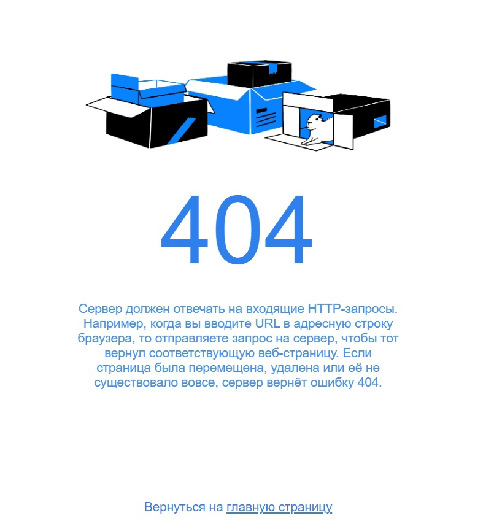

## Первый проект на Яндекс.Практикум

  По [ссылке](https://code.s3.yandex.net/web-developer/project-404/brief-404.pdf) вы найдёте бриф страницы в формате PDF 

Все выполнил по [Чек-листу](https://code.s3.yandex.net/web-developer/checklists-pdf/checklist-404.pdf)

Благодоря этому -> [руководству](https://doka.guide/css/transition/) удалось выполнить задание

